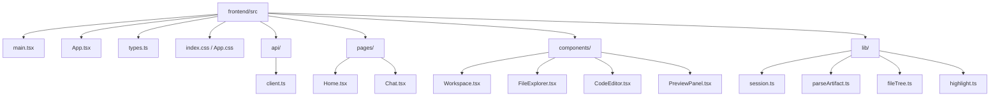
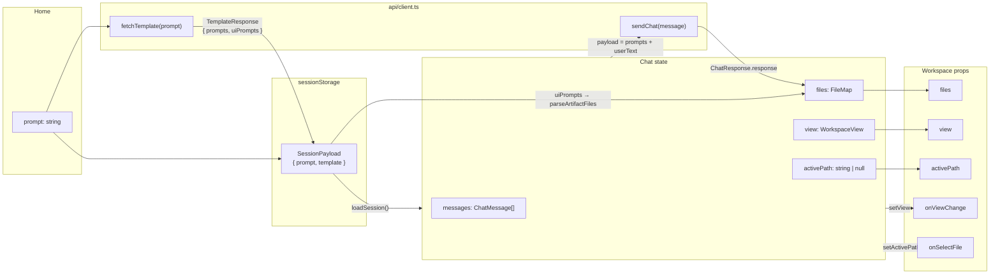
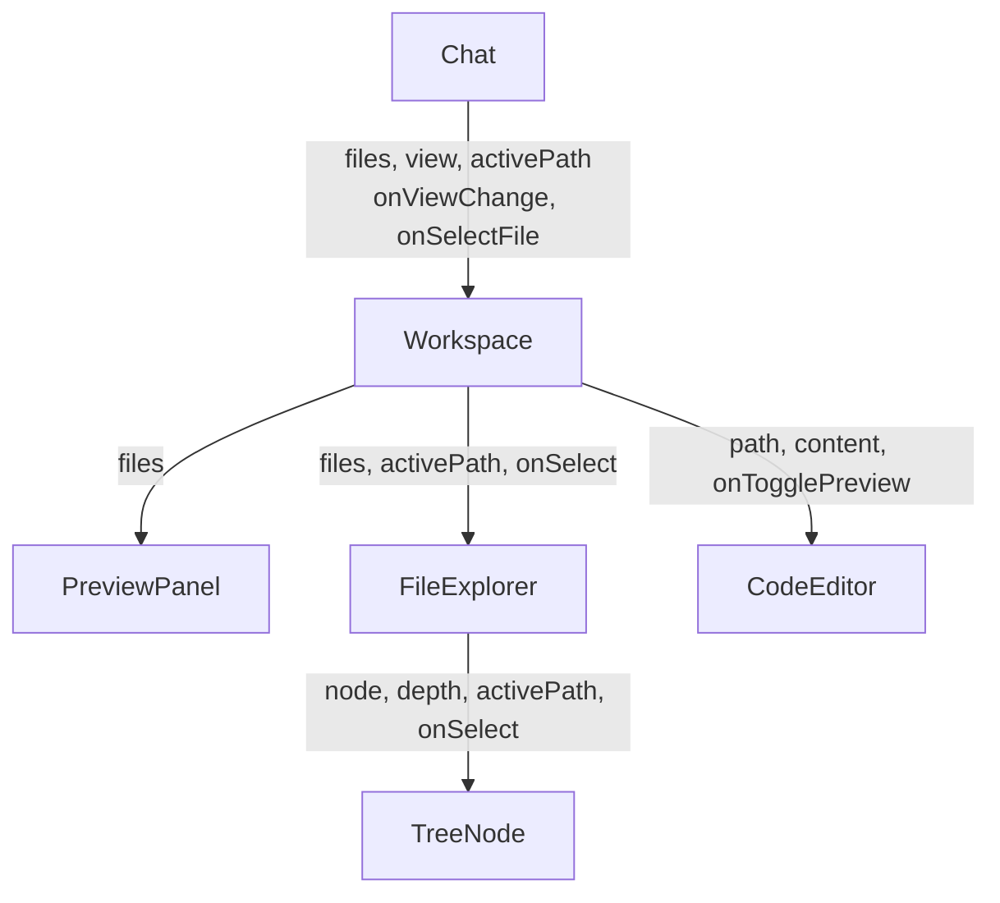
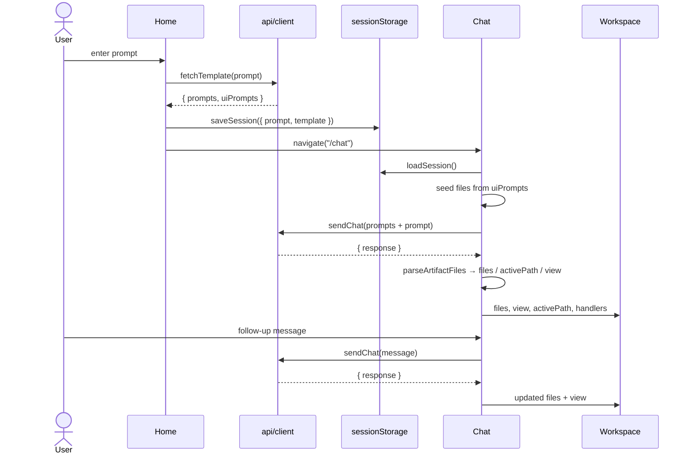

# frontend/src — folder structure & param flow

## 1. Folder structure

```mermaid
flowchart TB
  src["frontend/src"]

  src --> main["main.tsx"]
  src --> App["App.tsx"]
  src --> types["types.ts"]
  src --> css["index.css / App.css"]

  src --> api["api/"]
  api --> client["client.ts"]

  src --> pages["pages/"]
  pages --> Home["Home.tsx"]
  pages --> Chat["Chat.tsx"]

  src --> components["components/"]
  components --> Workspace["Workspace.tsx"]
  components --> FileExplorer["FileExplorer.tsx"]
  components --> CodeEditor["CodeEditor.tsx"]
  components --> PreviewPanel["PreviewPanel.tsx"]

  src --> lib["lib/"]
  lib --> session["session.ts"]
  lib --> parseArtifact["parseArtifact.ts"]
  lib --> fileTree["fileTree.ts"]
  lib --> highlight["highlight.ts"]
```

## 2. How params / data flow

```mermaid
flowchart LR
  subgraph HomePage["Home"]
    prompt["prompt: string"]
  end

  subgraph API["api/client.ts"]
    fetchTemplate["fetchTemplate(prompt)"]
    sendChat["sendChat(message)"]
  end

  subgraph Storage["sessionStorage"]
    session["SessionPayload\n{ prompt, template }"]
  end

  subgraph ChatPage["Chat state"]
    messages["messages: ChatMessage[]"]
    files["files: FileMap"]
    activePath["activePath: string | null"]
    view["view: WorkspaceView"]
  end

  subgraph WorkspaceProps["Workspace props"]
    Wfiles["files"]
    Wview["view"]
    Wactive["activePath"]
    WonView["onViewChange"]
    WonSelect["onSelectFile"]
  end

  prompt --> fetchTemplate
  fetchTemplate -->|"TemplateResponse\n{ prompts, uiPrompts }"| session
  prompt --> session
  session -->|"loadSession()"| ChatPage

  ChatPage -->|"payload = prompts + userText"| sendChat
  sendChat -->|"ChatResponse.response"| files
  session -->|"uiPrompts → parseArtifactFiles"| files

  files --> Wfiles
  view --> Wview
  activePath --> Wactive
  ChatPage -->|"setView"| WonView
  ChatPage -->|"setActivePath"| WonSelect
```

## 3. Component prop drill-down

```mermaid
flowchart TB
  Chat["Chat"]

  Chat -->|"files, view, activePath\nonViewChange, onSelectFile"| WS["Workspace"]

  WS -->|"files"| Preview["PreviewPanel"]
  WS -->|"files, activePath, onSelect"| FE["FileExplorer"]
  WS -->|"path, content, onTogglePreview"| CE["CodeEditor"]

  FE -->|"node, depth, activePath, onSelect"| Tree["TreeNode"]
```

## 4. End-to-end sequence

```mermaid
sequenceDiagram
  actor User
  participant Home
  participant Client as api/client
  participant Sess as sessionStorage
  participant Chat
  participant WS as Workspace

  User->>Home: enter prompt
  Home->>Client: fetchTemplate(prompt)
  Client-->>Home: { prompts, uiPrompts }
  Home->>Sess: saveSession({ prompt, template })
  Home->>Chat: navigate("/chat")

  Chat->>Sess: loadSession()
  Chat->>Chat: seed files from uiPrompts
  Chat->>Client: sendChat(prompts + prompt)
  Client-->>Chat: { response }
  Chat->>Chat: parseArtifactFiles → files / activePath / view
  Chat->>WS: files, view, activePath, handlers

  User->>Chat: follow-up message
  Chat->>Client: sendChat(message)
  Client-->>Chat: { response }
  Chat->>WS: updated files + view
```
